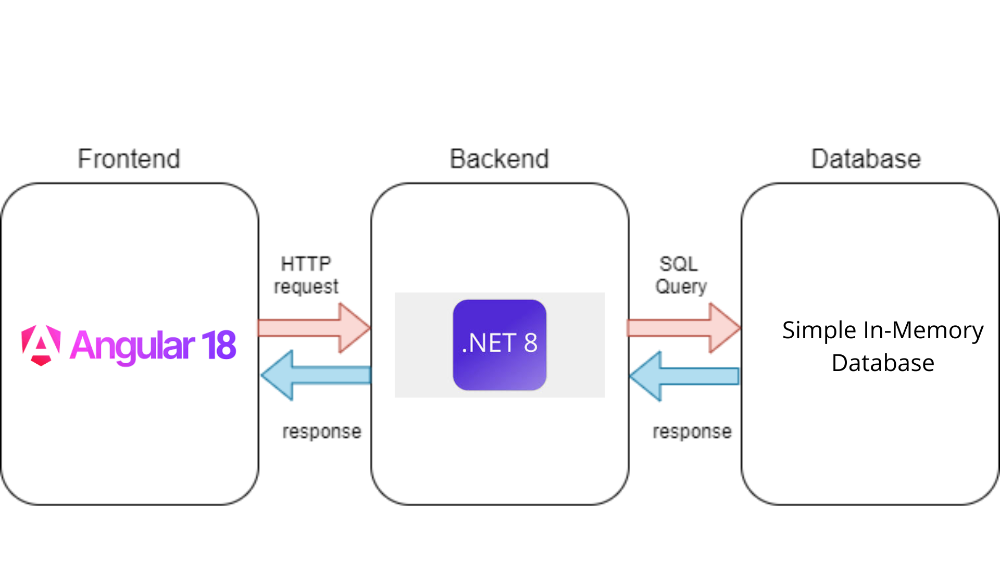
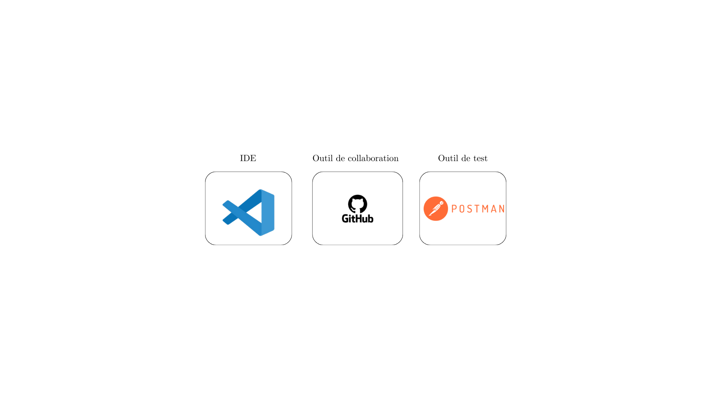

# Frontend

-------Expense Tracker App:-------

A simple web application to track expenses, manage budgets, and visualize spending with a pie chart. Users can add, view, delete expenses and set monthly budgets.

-->Features:

*Add, view, and delete expenses.

*Set and update monthly budget.

*Visualize expenses by category in a pie chart.

*Responsive and user-friendly interface.

-->Technologies Used:

*Frontend: Angular

*Backend: ASP.NET Core

*Charting: Chart.js

*Database: In-memory database

and i also used the following tools:

-->Setup:

*Clone the repo.

*Install dependencies: npm install (for frontend) or dotnet *restore (for backend).

*Run the backend: dotnet run.

*Run the frontend: ng serve.

